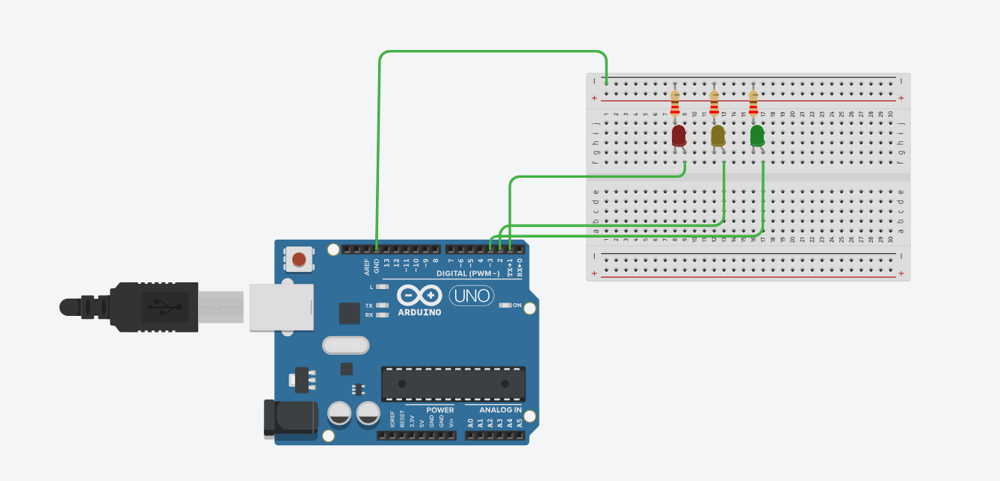

# Traffic Light Sequencing using Arduino

This project demonstrates a basic traffic light sequencing system using Arduino.

## Description
The system cycles through Red → Yellow → Green LEDs,
each state active for 1 second.

## Platform
- Arduino (simulated using Tinkercad Circuits)

## Components
- Arduino Uno (simulation)
- Red, Yellow, Green LEDs
- Resistors

## Circuit Diagram

## Note
This is a basic implementation intended for learning purposes.
